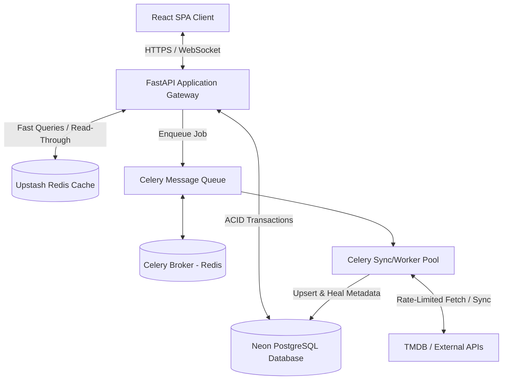
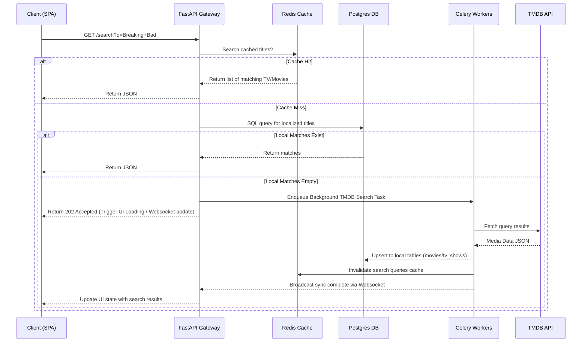
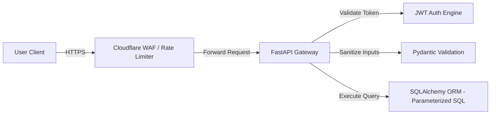

# Production-Grade Media Tracker Architecture Blueprint

This document defines the complete architectural blueprint and implementation plan for the proposed production-ready movie/TV tracker. 

## Architectural Philosophy & Core Decoupling
To achieve a billion-dollar product standard, we must treat **external metadata providers (TMDB, TVDB, AniList)** as untrusted, volatile, and rate-limited upstream dependencies. Our local database must act as the single source of truth for all user actions, and must remain fully functional even if external metadata APIs are completely down.



---

## 1. System-Wide Architectural Design

### Backend: Clean Architecture Layers
The backend is structured to isolate business logic (Domain/Application) from external frameworks, libraries, and transport protocols.

```
src/backend/
├── api/                   # Presentation Layer: FastAPI routers, schemas (Pydantic), middlewares, auth dependencies.
├── application/           # Application Layer: Use cases, CQRS commands/queries, transaction orchestrators.
├── domain/                # Domain Layer: Pure domain entities, value objects, domain events, business rules (no external deps).
├── infrastructure/        # Infrastructure Layer: Database configurations, third-party API clients, logging, caching providers.
├── repositories/          # Data Access Interface & Implementation: SQLAlchemy models, repository patterns.
├── services/              # Domain Services: Complex business logic spanning multiple entities (e.g., sync engines).
├── workers/               # Asynchronous Task Execution: Celery tasks, job orchestrators.
└── events/                # Event Handlers: Pub/Sub event schemas and dispatchers.
```

#### Why Every Layer Exists
*   **Domain**: Ensures business rules (e.g., "cannot watch season 2 episode 1 without unlock criteria" or "valid score ranges") are unit-testable in isolation without mocking databases or HTTP clients.
*   **Application**: Defines the orchestration flow (e.g., "fetch user profile, initiate watch progress update, dispatch user_watched event").
*   **API**: Translates HTTP/Websocket requests into application requests, manages CORS, handles routing, and processes serialization.
*   **Infrastructure**: Houses concrete implementations (e.g., TMDB API Client, Redis Cache Client). Changing the cache backend or metadata provider will not touch domain/application logic.
*   **Repositories**: Abstracts data retrieval. Provides mockable contracts for testing.

---

### Database: PostgreSQL Schema & Relational Design

#### High-Performance Normalized Schema
We must optimize for read path operations (which represent >90% of user traffic) while ensuring write operations for syncing are fast and deadlock-free.

```sql
-- Core User Schema
CREATE TABLE users (
    id UUID PRIMARY KEY DEFAULT gen_random_uuid(),
    email VARCHAR(255) UNIQUE NOT NULL,
    password_hash VARCHAR(255) NOT NULL,
    is_verified BOOLEAN DEFAULT FALSE,
    created_at TIMESTAMP WITH TIME ZONE DEFAULT CURRENT_TIMESTAMP,
    updated_at TIMESTAMP WITH TIME ZONE DEFAULT CURRENT_TIMESTAMP
);

CREATE TABLE user_preferences (
    user_id UUID PRIMARY KEY REFERENCES users(id) ON DELETE CASCADE,
    timezone VARCHAR(50) DEFAULT 'UTC',
    language VARCHAR(10) DEFAULT 'en',
    adult_content BOOLEAN DEFAULT FALSE,
    notification_email BOOLEAN DEFAULT TRUE,
    notification_push BOOLEAN DEFAULT TRUE,
    updated_at TIMESTAMP WITH TIME ZONE DEFAULT CURRENT_TIMESTAMP
);

-- Decoupled Metadata Cache (Local Source of Truth)
CREATE TABLE movies (
    id UUID PRIMARY KEY DEFAULT gen_random_uuid(),
    tmdb_id INTEGER UNIQUE NOT NULL,
    imdb_id VARCHAR(20),
    title VARCHAR(500) NOT NULL,
    original_title VARCHAR(500),
    overview TEXT,
    release_date DATE,
    runtime INTEGER, -- in minutes
    poster_path VARCHAR(255),
    backdrop_path VARCHAR(255),
    vote_average NUMERIC(3,1),
    vote_count INTEGER DEFAULT 0,
    status VARCHAR(50), -- Released, In Production, Planned
    created_at TIMESTAMP WITH TIME ZONE DEFAULT CURRENT_TIMESTAMP,
    updated_at TIMESTAMP WITH TIME ZONE DEFAULT CURRENT_TIMESTAMP
);

CREATE TABLE tv_shows (
    id UUID PRIMARY KEY DEFAULT gen_random_uuid(),
    tmdb_id INTEGER UNIQUE NOT NULL,
    imdb_id VARCHAR(20),
    title VARCHAR(500) NOT NULL,
    overview TEXT,
    first_air_date DATE,
    last_air_date DATE,
    status VARCHAR(50), -- Returning Series, Ended, Canceled
    poster_path VARCHAR(255),
    backdrop_path VARCHAR(255),
    vote_average NUMERIC(3,1),
    vote_count INTEGER DEFAULT 0,
    created_at TIMESTAMP WITH TIME ZONE DEFAULT CURRENT_TIMESTAMP,
    updated_at TIMESTAMP WITH TIME ZONE DEFAULT CURRENT_TIMESTAMP
);

CREATE TABLE seasons (
    id UUID PRIMARY KEY DEFAULT gen_random_uuid(),
    tv_show_id UUID NOT NULL REFERENCES tv_shows(id) ON DELETE CASCADE,
    tmdb_id INTEGER UNIQUE NOT NULL,
    season_number INTEGER NOT NULL,
    episode_count INTEGER NOT NULL,
    air_date DATE,
    poster_path VARCHAR(255),
    created_at TIMESTAMP WITH TIME ZONE DEFAULT CURRENT_TIMESTAMP,
    updated_at TIMESTAMP WITH TIME ZONE DEFAULT CURRENT_TIMESTAMP,
    CONSTRAINT unique_show_season UNIQUE (tv_show_id, season_number)
);

CREATE TABLE episodes (
    id UUID PRIMARY KEY DEFAULT gen_random_uuid(),
    season_id UUID NOT NULL REFERENCES seasons(id) ON DELETE CASCADE,
    tmdb_id INTEGER UNIQUE NOT NULL,
    episode_number INTEGER NOT NULL,
    absolute_number INTEGER, -- Critically needed for Anime / Absolute numbering systems
    title VARCHAR(500) NOT NULL,
    overview TEXT,
    air_date DATE,
    runtime INTEGER, -- in minutes
    still_path VARCHAR(255),
    created_at TIMESTAMP WITH TIME ZONE DEFAULT CURRENT_TIMESTAMP,
    updated_at TIMESTAMP WITH TIME ZONE DEFAULT CURRENT_TIMESTAMP,
    CONSTRAINT unique_season_episode UNIQUE (season_id, episode_number)
);

-- Watch Progress & History
-- Partitioned by Range of watched_at or Hash of user_id
CREATE TABLE watch_history (
    id UUID NOT NULL,
    user_id UUID NOT NULL REFERENCES users(id) ON DELETE CASCADE,
    media_type VARCHAR(10) NOT NULL, -- 'movie' or 'episode'
    media_id UUID NOT NULL, -- Points to movies(id) or episodes(id) depending on media_type
    watched_at TIMESTAMP WITH TIME ZONE DEFAULT CURRENT_TIMESTAMP,
    duration_seconds INTEGER DEFAULT 0, -- Time spent watching if tracked via scrobbler
    completed BOOLEAN DEFAULT TRUE,
    device_info VARCHAR(255),
    created_at TIMESTAMP WITH TIME ZONE DEFAULT CURRENT_TIMESTAMP,
    PRIMARY KEY (id, user_id) -- Composite key required for partitioning by user_id or Range
);

CREATE TABLE watch_progress (
    user_id UUID NOT NULL REFERENCES users(id) ON DELETE CASCADE,
    tv_show_id UUID NOT NULL REFERENCES tv_shows(id) ON DELETE CASCADE,
    last_watched_episode_id UUID REFERENCES episodes(id) ON DELETE SET NULL,
    progress_percent NUMERIC(5,2) DEFAULT 0.00, -- percentage of overall series watched
    last_watched_at TIMESTAMP WITH TIME ZONE DEFAULT CURRENT_TIMESTAMP,
    PRIMARY KEY (user_id, tv_show_id)
);

-- Notifications (Avoid O(N * M) scaling issues - see Pull Notification pattern in Notification Engine)
CREATE TABLE release_notifications (
    id UUID PRIMARY KEY DEFAULT gen_random_uuid(),
    media_type VARCHAR(10) NOT NULL, -- 'episode' or 'movie'
    media_id UUID NOT NULL, -- links to movies(id) or episodes(id)
    event_type VARCHAR(50) NOT NULL, -- 'release', 'announcement', 'date_change'
    payload JSONB NOT NULL,
    triggered_at TIMESTAMP WITH TIME ZONE DEFAULT CURRENT_TIMESTAMP
);

CREATE TABLE user_notifications (
    id UUID PRIMARY KEY DEFAULT gen_random_uuid(),
    user_id UUID NOT NULL REFERENCES users(id) ON DELETE CASCADE,
    notification_type VARCHAR(50) NOT NULL, -- 'personal_alert', 'system_broadcast'
    title VARCHAR(255) NOT NULL,
    body TEXT NOT NULL,
    is_read BOOLEAN DEFAULT FALSE,
    created_at TIMESTAMP WITH TIME ZONE DEFAULT CURRENT_TIMESTAMP
);

-- User Engagement & Lists
CREATE TABLE ratings (
    user_id UUID NOT NULL REFERENCES users(id) ON DELETE CASCADE,
    media_type VARCHAR(10) NOT NULL, -- 'movie', 'tv_show', 'episode'
    media_id UUID NOT NULL,
    rating INTEGER NOT NULL CHECK (rating >= 1 AND rating <= 10),
    created_at TIMESTAMP WITH TIME ZONE DEFAULT CURRENT_TIMESTAMP,
    updated_at TIMESTAMP WITH TIME ZONE DEFAULT CURRENT_TIMESTAMP,
    PRIMARY KEY (user_id, media_type, media_id)
);

CREATE TABLE reviews (
    id UUID PRIMARY KEY DEFAULT gen_random_uuid(),
    user_id UUID NOT NULL REFERENCES users(id) ON DELETE CASCADE,
    media_type VARCHAR(10) NOT NULL,
    media_id UUID NOT NULL,
    content TEXT NOT NULL,
    is_spoiler BOOLEAN DEFAULT FALSE,
    likes_count INTEGER DEFAULT 0,
    created_at TIMESTAMP WITH TIME ZONE DEFAULT CURRENT_TIMESTAMP,
    updated_at TIMESTAMP WITH TIME ZONE DEFAULT CURRENT_TIMESTAMP
);

CREATE TABLE lists (
    id UUID PRIMARY KEY DEFAULT gen_random_uuid(),
    user_id UUID NOT NULL REFERENCES users(id) ON DELETE CASCADE,
    name VARCHAR(255) NOT NULL,
    description TEXT,
    is_private BOOLEAN DEFAULT TRUE,
    created_at TIMESTAMP WITH TIME ZONE DEFAULT CURRENT_TIMESTAMP,
    updated_at TIMESTAMP WITH TIME ZONE DEFAULT CURRENT_TIMESTAMP
);

CREATE TABLE list_items (
    list_id UUID NOT NULL REFERENCES lists(id) ON DELETE CASCADE,
    media_type VARCHAR(10) NOT NULL,
    media_id UUID NOT NULL,
    position INTEGER NOT NULL,
    created_at TIMESTAMP WITH TIME ZONE DEFAULT CURRENT_TIMESTAMP,
    PRIMARY KEY (list_id, media_type, media_id)
);

-- Audit & Feed Logs
CREATE TABLE audit_logs (
    id UUID PRIMARY KEY DEFAULT gen_random_uuid(),
    user_id UUID REFERENCES users(id) ON DELETE SET NULL,
    action VARCHAR(100) NOT NULL,
    ip_address VARCHAR(45),
    user_agent TEXT,
    payload JSONB,
    created_at TIMESTAMP WITH TIME ZONE DEFAULT CURRENT_TIMESTAMP
);
```

#### Indexing Strategy
1.  `watch_history (user_id, watched_at DESC)`: Essential for retrieving watch feeds and statistics quickly.
2.  `episodes (season_id, episode_number)`: For fast lookup of next episodes and sequence evaluation.
3.  `watch_progress (user_id, last_watched_at DESC)`: Speeds up the "Up Next" feed on the dashboard.
4.  `movies (tmdb_id)` & `tv_shows (tmdb_id)`: Speeds up mapping operations during worker metadata updates.
5.  `ratings (media_type, media_id, rating)`: To calculate average ratings efficiently without counting millions of rows on the fly.

#### Database Hotspots & Scaling Plans
*   **Hotspot: `watch_history`**: As users log watched items, this table will scale into billions of rows.
    *   *Solution*: Partition `watch_history` by **Hash of `user_id`** (e.g., 64 partitions). This localizes query execution for user dashboard requests and keeps indexing structures memory-resident.
*   **Archival Strategy**: Move entries older than 3 years from `watch_history` to cold storage (e.g., Parquet files on S3 queried via Athena) if a user has not accessed them, keeping only summary aggregates locally.

---

### Frontend: Scalable Architecture (React + TypeScript)
To support a high-performance web app, we structure the React codebase by features to ensure encapsulation and code-splitting capabilities.

```
src/frontend/
├── assets/                # Core brand media and global icons
├── components/            # UI components (Button, Input, Card, Modal, Skeletal Loaders)
├── config/                # Environment variables, client wrappers
├── features/              # Feature Modules
│   ├── auth/              # Logic for signin, signup, google oauth
│   ├── search/            # Search query, autocomplete, TMDB query engine
│   ├── tracking/          # Scrobbler, Watch History, Progress bar
│   ├── dashboard/         # Feed aggregations, up next indicators
│   └── statistics/        # Recharts, analytics widgets
├── hooks/                 # Global React hooks (useAuth, useLocalStorage)
├── layouts/               # Dashboard Layout, Auth Layout
├── providers/             # React Context Providers (QueryClient, AuthProvider)
├── routes/                # Router definition
└── utils/                 # Pure helper functions
```

---

## 2. Core Module Architecture Blueprints

### Module 1: Search & Metadata Engine (TMDB Integration)

#### Problem
TMDB is rate-limited, frequently changes release dates, and can be completely unavailable. Relying on raw TMDB lookups during search queries blocks requests, results in slow page loads, and runs the risk of hitting the 429 rate limits rapidly.

#### Goal
Implement a resilient local-first metadata search system with optimistic fetch fallbacks.

#### Architecture & Data Flow



#### Challenge & Devil's Advocate
*   *Why should this exist?* To allow users to find and track shows.
*   *Challenge*: Why local cache? Why not search TMDB on-the-fly? Searching TMDB directly introduces a 300-600ms latency hit, creates dependency risks, and makes indexing user history impossible.
*   *Security Risks*: Injection in search fields; SSRF if we fetch TMDB URLs dynamically based on user parameters.
*   *Complexity Score*: **6/10** (Due to mapping logic and asynchronous reconciliation).

---

### Module 2: Sync & Progress Conciliation Engine

#### Problem
Users watch episodes offline or on multiple devices. Simple Last-Write-Wins updates create sync conflicts where progress is lost or rolled back.

#### Goal
Create a deterministic, conflict-free sync engine.

#### Database Design Adjustments
Add `synced_at` and `version` columns to progress trackers. Create a `client_sync_logs` table:
```sql
CREATE TABLE client_sync_logs (
    id UUID PRIMARY KEY DEFAULT gen_random_uuid(),
    user_id UUID REFERENCES users(id) ON DELETE CASCADE,
    device_id VARCHAR(100) NOT NULL,
    action_type VARCHAR(50) NOT NULL, -- 'watch', 'unwatch', 'rate'
    media_id UUID NOT NULL,
    action_timestamp TIMESTAMP WITH TIME ZONE NOT NULL,
    synced_at TIMESTAMP WITH TIME ZONE DEFAULT CURRENT_TIMESTAMP
);
```

#### Synchronous Conciliation Logic (CRDT-like)
When syncing progress:
1. Client pushes transaction logs containing `(action_timestamp, action_type, media_id)`.
2. Backend applies actions in exact chronological order of their occurrence (`action_timestamp`), not when the payload was received (`synced_at`).
3. If an episode is already marked as watched with an older timestamp, the write succeeds but watch count aggregates do not duplicate.

#### Failure Scenarios
*   *Redis is down*: Sync queue falls back to writing directly to the PostgreSQL audit log table, degrading write-heavy speed but preventing data loss.
*   *Complexity Score*: **8/10**

---

### Module 3: Notification Fan-Out Engine

#### Problem
If 1,000,000 users track a show, and a new episode airs, inserting 1,000,000 rows into a `user_notifications` table concurrently will crash PostgreSQL and trigger high CPU warnings.

#### Goal
A Hybrid Pull-based Notification Engine that minimizes database writes.

#### Architecture
Instead of storing a unique record per user when a release event occurs:
1. Store a single record in `release_notifications`.
2. When the user logs in or requests notifications, run a **Pull Query**:
```sql
SELECT rn.* 
FROM release_notifications rn
JOIN watch_progress wp ON wp.tv_show_id = rn.media_id
WHERE wp.user_id = :user_id 
  AND rn.triggered_at > wp.last_watched_at
  AND rn.triggered_at > :user_last_checked_notification_at;
```
This reads from indexes, requiring **zero** database writes at release time.

#### Challenge & Devil's Advocate
*   *Challenge*: What about customized alerts? (e.g., "Season 2 will change date").
*   *Solution*: The pull engine works because the notification structure is identical for everyone tracking the show. Personal notifications (like reviews getting liked) are written directly.
*   *Complexity Score*: **7/10**

---

## 3. Operations & Resilience Blueprint

### Background Job Resiliency
Using Celery & Redis, we mitigate failures through:
*   **Idempotency Keying**: Every task is queued with a SHA-256 hash of its parameter set. If a task with the same hash exists in Redis, the broker discards the duplicate.
*   **Dead-Letter Queues (DLQ)**: Tasks that fail after 3 retries (due to TMDB schema changes or DB outages) are routed to a `dlq_failures` table for administrative review.
*   **Distributed Locks**: Celery tasks targeting metadata sync acquire a Redis lock using `redlock` on the TMDB ID. This prevents race conditions where two workers concurrently attempt to insert/update the same show.

### Security Architecture



*   **OAuth Risk mitigation**: Use PKCE (Proof Key for Code Exchange) on the client side to secure authentication codes.
*   **Token Lifecycle**: Access tokens are short-lived (15 minutes), refresh tokens are long-lived (7 days) and stored in `HttpOnly`, `Secure`, `SameSite=Strict` cookies. Refresh tokens are rotated on usage (Refresh Token Rotation) to prevent replay attacks.
*   **Rate Limiting**: Custom Redis rate-limiter middleware. Limits are dynamic (e.g., search endpoints allow 20 requests/minute, watch-log endpoints allow 100/minute).

---

## 4. Verification Plan

### Automated Testing Strategy
*   **Unit Tests**: Standard pytest suite for domain logic.
*   **Integration Tests**: Run FastAPI endpoint tests against a Dockerized test PostgreSQL instance using testcontainers.
*   **Chaos Testing**: Script to mock high latency/failure of the Neon PG instance and Upstash Redis. Test that application recovers gracefully without leaking data.
*   **Load Testing**: K6 script testing concurrent synchronization of 10,000 mock clients hitting the sync endpoint.

---

## 5. Implementation Roadmap & Milestones

1.  **Phase 1: Foundation (Database & API Shell)**
    *   Set up FastAPI folder structure, database connection pooling, migrations setup (Alembic), and OAuth/JWT configuration.
2.  **Phase 2: Sync and Metadata Engine**
    *   Implement Celery workers, TMDB local mirror schemas, and conflict-free watch sync controllers.
3.  **Phase 3: Frontend Interface & PWA Logic**
    *   Build feature folders, configure TanStack Query with optimistic UI state caching, and set up Service Workers for offline storage.
4.  **Phase 4: Notifications & Observability**
    *   Build pull-based notification logic, implement Prometheus metrics, and set up structured logging.

---

### Open Questions for User Approval
1. **Streaming Providers Tracking**: Do we need to track provider availability (e.g., JustWatch API integration) globally or filter search results by country-specific providers?
2. **Offline Mode Limitations**: How long should we allow client-side offline progress logging before requiring a sync check-in (e.g., limit cache size to 100 un-synced episodes)?
3. **Data Anonymization**: Should our audit and activity logs have GDPR-compliant automated purging or anonymization rules?
